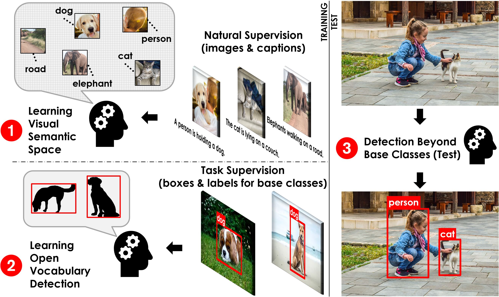
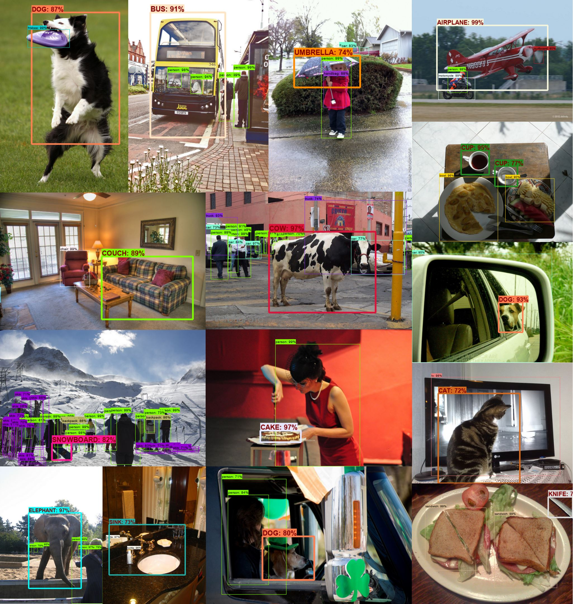

# Open-Vocabulary Object Detection Using Captions

[Alireza Zareian](https://www.linkedin.com/in/az2407/), &nbsp; &nbsp; &nbsp; &nbsp; 
Kevin Dela Rosa, &nbsp; &nbsp; &nbsp; &nbsp; 
Derek Hao Hu, &nbsp; &nbsp; &nbsp; &nbsp; 
[Shih-Fu Chang](https://www.ee.columbia.edu/~sfchang/)

[Digital Video and Multimedia - Columbia University](https://www.ee.columbia.edu/ln/dvmm/),
&nbsp; &nbsp; &nbsp; &nbsp; &nbsp; &nbsp; &nbsp; &nbsp; 
Snap Inc.

A new object detection framework, which is more scalable, more practical, and more versatile than existing formulations.

Published and presented as an oral paper at CVPR 2021 (Conference on Computer Vision and Pattern Recognition).

<a href="#"><button disabled>View Proceedings</button></a>
&nbsp; &nbsp; &nbsp; &nbsp; 
<a href="https://arxiv.org/abs/2011.10678"><button>Read on arXiv</button></a>
&nbsp; &nbsp; &nbsp; &nbsp; 
<a href="#"><button disabled>Watch the Talk</button></a>

### Abstract

Despite the remarkable accuracy of deep neural networks in object detection, they are costly to train and scale due to supervision requirements. Particularly, learning more object categories typically requires proportionally more bounding box annotations. Weakly supervised and zero-shot learning techniques have been explored to scale object detectors to more categories with less supervision, but they have not been as successful and widely adopted as supervised models. In this paper, we put forth a novel formulation of the object detection problem, namely open-vocabulary object detection, which is more general, more practical, and more effective than weakly supervised and zero-shot approaches. We propose a new method to train object detectors using bounding box annotations for a limited set of object categories, as well as image-caption pairs that cover a larger variety of objects at a significantly lower cost. We show that the proposed method can detect and localize objects for which no bounding box annotation is provided during training, at a significantly higher accuracy than zero-shot approaches. Meanwhile, objects with bounding box annotation can be detected almost as accurately as supervised methods, which is significantly better than weakly supervised baselines. Accordingly, we establish a new state of the art for scalable object detection.

### Citation:
```
@InProceedings{Zareian_2021_CVPR,
author={Zareian, Alireza and Rosa, Kevin Dela and Hu, Derek Hao and Chang, Shih-Fu},
title = {Open-Vocabulary Object Detection Using Captions},
booktitle = {IEEE/CVF Conference on Computer Vision and Pattern Recognition (CVPR)},
month = {June},
year = {2021}
}
```

### Quick Overview:



An overview of Open-Vocabulary Object Detection. We propose a two-stage training framework where we first (1) construct a visual-semantic space using low-cost image-caption pairs, and then (2) learn object detection using object annotations for a set of base classes. During test (3), the goal is to detect object categories beyond base classes, by exploiting the semantic space.

### Examples:



Qualitative results of our OVR-CNN model, detecting both base and target classes. Target classes are shown with larger font, thicker border, and uppercase.

### Oral Talk:

Coming soon ...
<!--- [](#) --->
